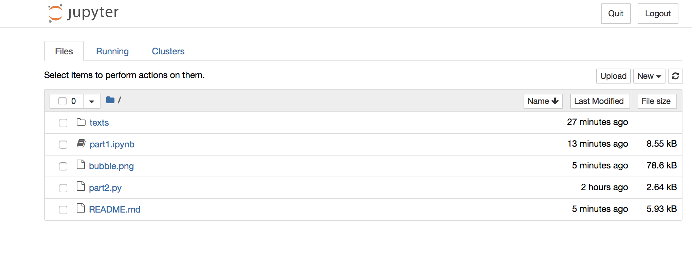
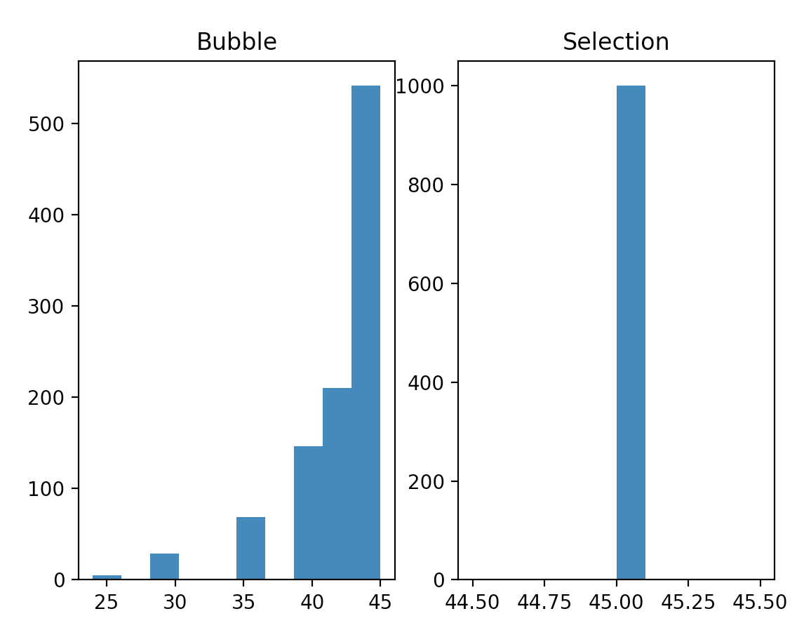

# Problem Set 10 (the last problem set!)

### Due Wednesday, December 7, 11:59pm EST

As always, you will submit to Canvas **a single .zip file**. Detailed instructions for what the .zip file should contain are at the end of this problem set. 

Download this whole directory **to your desktop (!!!)**, unzip it, and carry out the tasks described below.

---

## Part 1: Writing Python with a Jupyter notebook

### Step 1: Installing jupyter
To use a Jupyter notebook, you need to install the `juypter` library. To do so, just follow [the directions in PS7 for installing libraries](https://github.com/CSCI-1101-TTh12-F22/ps7#step-1-install-the-libraries). In other words, on a Mac, launch a Terminal and type:

`pip3 install jupyter`

Or on a Windows machine, launch Command and type the above command with and without the `3` or the following:

`py -3 -m pip install jupyter`

Be sure to check the alternative things to type in [the previous instructions for installing libraries](https://github.com/CSCI-1101-TTh12-F22/ps7#step-1-install-the-libraries) in case you have an unusual configuration.

### Step 2: Opening the jupyter notebook
Keep your terminal open! You need to navigate to the folder you downloaded in order to access the jupyter notebook, `part1.ipynb`. Recall that your `ps10-main` folder you downloaded must be on your desktop in order for these instructions to work. Here is how to do it:

* On a **Mac**, open a Terminal and type: 

```
cd ~/Desktop/ps10-main
jupyter notebook
```

* On **Windows**, in the `command` or `cmd` application, type the following:

```
cd Desktop\ps10-main
```

If you get an error, try this instead, where `your-username` is your username.

```
cd C:\Users\your-username\Desktop\ps10-main
```

Then type

```
jupyter notebook
```

or if that doesn't work:

```
py -3 -m jupyter notebook
```

* On both Windows and Mac, this will open your default browser, and you'll see a screen that looks like this:



* Click on the file called `part1.ipynb` to complete Part 1 of the problem set.

### Step 3: Using a jupyter notebook
Continue with the rest of Part 1 by following the instructions in the provided jupyter notebook, `part1.ipynb`.

---

## Part 2: Running a program from the command line 

### Step 1
Open `part2.py` as you normally would in IDLE.

### Step 2
Insert a print statement just inside the outside for loop in each of the two sorting functions. The print statement should print out whatever is provided as a command line argument (i.e., `sys.argv[1]`).

### Step 3: Running a Python program in a terminal as follows

* Open a Terminal (in Mac) or cmd/Command (in Windows). Follow the steps in **Part 1, Step 2** above to navigate to this folder using the `cd` command, which works in both Mac and Windows.

* Type the following:

```
python3 part2.py GOOOOOOOOOOOOL
```

* If you are on Windows, you might need to type:

```
python part2.py GOOOOOOOOOOOOL
```
or

```
py3 part2.py GOOOOOOOOOOOOL
```
You should see the output of the print statements you inserted, namely `GOOOOOOOOOOOOL`. Why did you do this? To learn about why we call those command line arguments. They are arguments provided on the command line. :)

### Step 4: Finish writing the program
Now you will finish writing `part2.py` to run a simulation to approximate the best case, worst case, and average case for bubble sort and selection sort. You'll see that I have included the basic code for bubble sort and selection sort so all you need to do is run the simulation as follows:

* First, you will modify the code of these two functions to **return** the number of comparisons that are made in one run of the function.

* The rest of your code will be in your `main()` function. First, create two empty lists `bubblelist` and `selectionlist`. These will store how many comparisons it took for each time you call each function.
 
* Generate 1000 different lists of length 10 of random integers using a function in the `random` library. (There might be something better than `randint()` for doing this, so have a look at the documentation for `random`.)   
 
* Every time you generate a list of 10 random integers, make a copy of it. (Not sure how to do that? Have a look [here](https://www.w3schools.com/python/python_lists_copy.asp).) Then submit one copy of the list to bubble sort and one copy to selection sort. Each time you call one of these functions, it will return the number of required comparisons. Use `bubblelist` and `selectionlist` to keep track of how many comparisons were required. 
 
* Then report the minimum number of comparisons, the maximum number of comparisons, and the average number of comparisons for each sorting algorithm. 
 
* Finally, plot an appropriate labeled histogram for each list.

Remember that you should frequently test your program by saving it and running it! Insert **print statements** to debug as needed.

Below I have provided *pseudo-code* for you to implement in your `main()` function. This pseudocode is included as comments in the `part2.py` file.

```
declare bubblelist, selectionlist as empty lists
declare counter as an int equal to 0
while counter < 1000
   create list of length 10 containing ten random integers between 1 and 100 (duplicates are okay)
   make a copy of that list
   submit the first list to bubblesort()
   append the result (i.e., number of comparisons returned) to bubblelist
   submit the second list to selectionsort()
   append the result (i.e., number of comparisons returned) to selectionlist

print min, max, average of bubblelist
print min, max, average of selectionlist

create a plot with two subplots
plot histogram of bubblelist with appropriate labels
plot histogram of selectionlist with appropriate labels
```

Here is some output I got. Note that your exact numbers will be different since the lists are randomly generated.

```
Bubble sort:     min=24, max=45, mean=42.017
Selection sort:  min=45, max=45, mean=45.0
```



### Step 6: Document your use of the shell (command line, Terminal) for calling your function
Take a screenshot of your program call with the command line argument and the output on the terminal/cmd so that I know you used the terminal/cmd to run the program.

---

## What to submit
Make sure that `part1.ipynb` and `part2.py` are complete and run as expected. Then make sure they are in your `ps10-main` folder, along with your screenshot(s). Zip up the `ps10-main` folder, and submit the zipped file to Canvas.
 
 ### Due Wednesday, December 7, at 11:59pm EST
